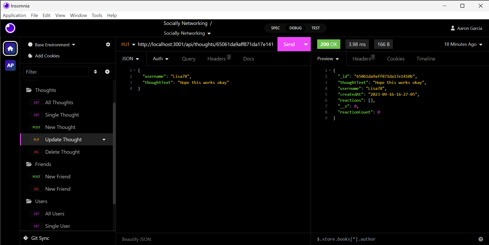
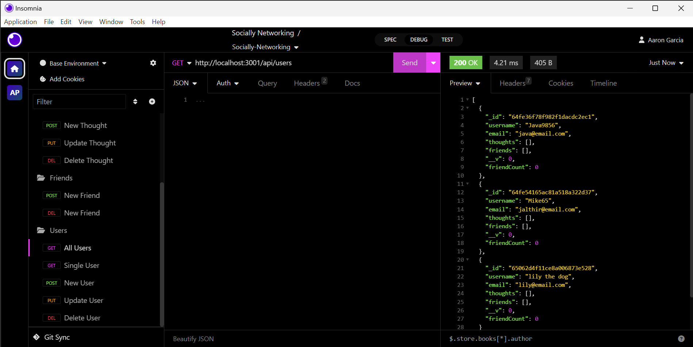
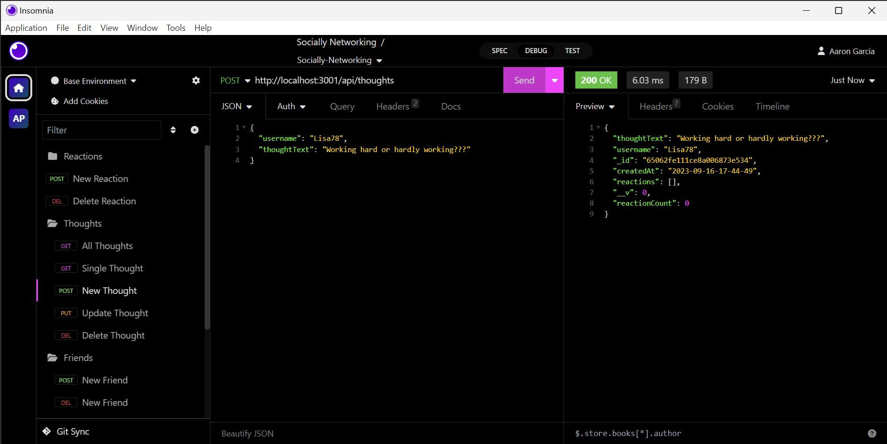

  

# Socially-Networking

## Description
Very basic noSql app that uses noSql to keep track of users, their friends, thoughts the user may have and reactions. Stsrt to what could be a great social networking platform. 

## Table of Contents
- [Installation](#Installation)
- [Usage](#Usage)
- [Credits](#Credits)
- [License](#License)
- [Contributors](#Contributing)
- [Tests](#Tests)
- [Questions](#Questions)

## Installation
Please install node.js 
  
## Usage 
This app shows the backend workings of a social networking platform that will help people connect and express their thoughts as well as give their reactions to other people's thoughts.
Can be found at: https://drive.google.com/file/d/1076FszwsedozhAES_xafAuq4kq1UtVYI/view or
https://youtu.be/QpBG7MH3keA

## Credits
I used much of the class examples to create this app and did use guidance from Github user njthanhtrang at https://github.com/njthanhtrang for some of the reactions and friends routes logic.

## License 
For more info, please visit: [License Link](https://opensource.org/licenses/MIT)

## Contributing
Feel free to add wonderful features and get the reactions field to actually use the ReactionId. 

## Tests 
There are no tests for this at the moment

## Questions 
If you have any questions you can find me at [SilvAG6271](https://github.com/SilvAG6271) and <a href="mailto:auron7985@gmail.com">auron7985@gmail.com</a>.
